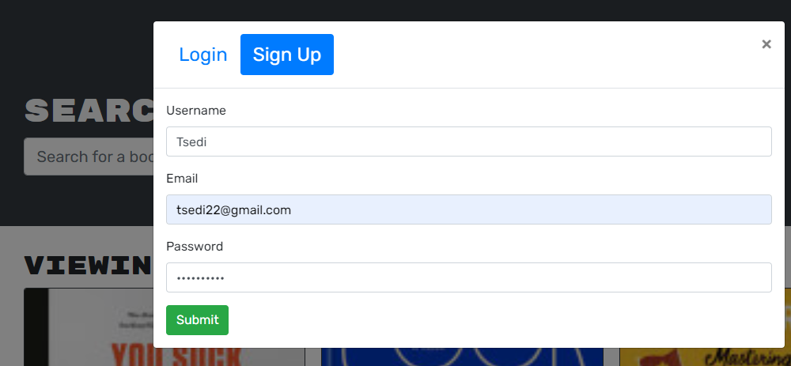

# book-search-engine
```
Google Books API search engine built in MERN Stack.


### Github : https://github.com/Tsedi28/book-search-engine

### Website : https://book-search-engine4.herokuapp.com/

### video recording : https://drive.google.com/file/d/1XiwsfvPuvmTx-QcXv9NnhnerTM6dqBdp/view


## Table of Contents

- [Description](#description)
- [User Story](#userstory)
- [Technology](#Technology)
- [Installation](#installation)
- [Usage](#usage)
- [Screenshots](#screenshots)
- [License](#license)
- [Contribution](#contributor)


## Description:

Google Books API search engine built in MERN Stack. Other than searching for books, users can sign up and login their account to save their favorive books.

## User Story
- AS AN avid reader
- I WANT to search for new books to read
- SO THAT I can keep a list of books to purchase

## Usage

Application allows users to search books with keywords.
Users are able to create an account when providing user name, email and password.
Logged in users will are able to save their favorite books as well as delete them.
Saved books are stored in their account, so next time they login, the books are still in their account to be viewed.

## Screenshots:




## Technology:
<p><a href="https://www.mongodb.com/">MongoDB</a></p>
<p><a href="https://www.npmjs.com/package/express">Express.js</a></p>
<p><a href="https://reactjs.org/">React.js</a></p>
<p><a href="https://nodejs.org/">Node.js</a></p>


## License

[](https://opensource.org/licenses/Apache-2.0) <br>


## Contributor
Tsedenia Bogale ©2023 All Rights Reserved.
- - -
